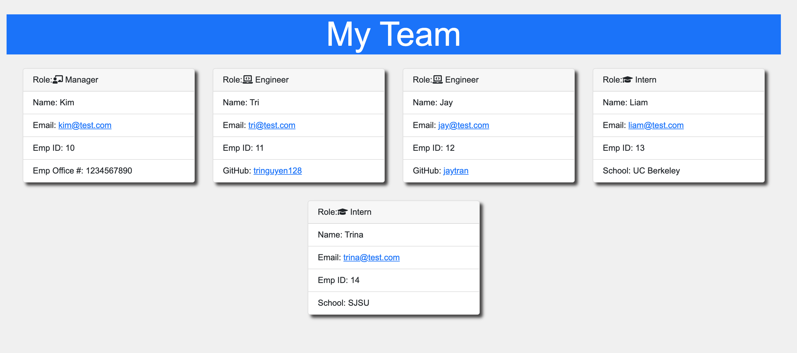

<h1 align = "center">TeamProfile_Generator</h1>


## Description 📁

This application only run through the terminal using node.js to start based on questiones set up. After answer all questions, an HTML file will be generated for you to use displaying your team members role, email, id, name, as well as office number/github username/school if applicable. This project builds upon Node.js as well as incorporates object oriented programming concepts as well as unit testing. For this endeavor, no start code was provided.

## User Story 👩

```md
AS A manager
I WANT to generate a webpage that displays my team's basic info
SO THAT I have quick access to their emails and GitHub profiles
```

## Acceptance Criteria ✅

```md
GIVEN a command-line application that accepts user input
WHEN I am prompted for my team members and their information
THEN an HTML file is generated that displays a nicely formatted team roster based on user input
WHEN I click on an email address in the HTML
THEN my default email program opens and populates the TO field of the email with the address
WHEN I click on the GitHub username
THEN that GitHub profile opens in a new tab
WHEN I start the application
THEN I am prompted to enter the team manager’s name, employee ID, email address, and office number
WHEN I enter the team manager’s name, employee ID, email address, and office number
THEN I am presented with a menu with the option to add an engineer or an intern or to finish building my team
WHEN I select the engineer option
THEN I am prompted to enter the engineer’s name, ID, email, and GitHub username, and I am taken back to the menu
WHEN I select the intern option
THEN I am prompted to enter the intern’s name, ID, email, and school, and I am taken back to the menu
WHEN I decide to finish building my team
THEN I exit the application, and the HTML is generated
```

## Installation 💾

To install the necessary dependencies, please run the following (individually) in your terminal:

        npm init -y
        npm install inquirer
        npm install jest --save-dev

## Tests
Jest installation required
To run tests, please run the following in your terminal:

        npm run test

## Testing Status


## Technologies Used 💻

- Node.js
- JavaScript
- npm packages

## Preview

- Video Demo: https://youtu.be/Vw1RR5qn4GI
- Screen Shot of final product:
  

## Resources 💡

Module 10 document
https://www.youtube.com/watch?v=FgnxcUQ5vho&t=442s
https://www.youtube.com/watch?v=y9JQdKgdgnM


## Future Development

- Add validators to each input to ensure the appropriate information is being entered by the user
- Add more feature to syle page using CSS

## License

This project is covered under the MIT license.